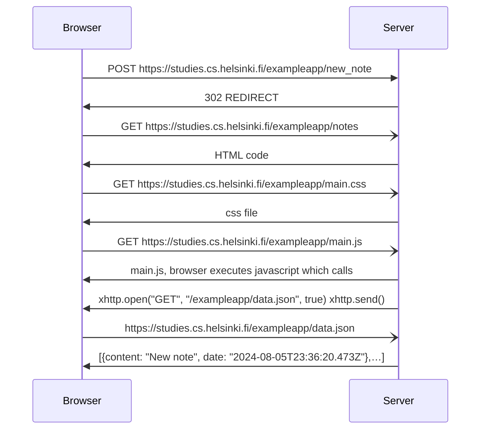

```mermaid
sequenceDiagram
    Browser->>Server: POST https://studies.cs.helsinki.fi/exampleapp/new_note
    Server->>Browser: 302 REDIRECT
    Browser-)Server: GET https://studies.cs.helsinki.fi/exampleapp/notes
    Server->>Browser: HTML code
    Browser-)Server: GET https://studies.cs.helsinki.fi/exampleapp/main.css
    Server->>Browser: css file
    Browser-)Server: GET https://studies.cs.helsinki.fi/exampleapp/main.js
    Server->>Browser: main.js, browser executes javascript which calls
    Server->>Browser: xhttp.open("GET", "/exampleapp/data.json", true) xhttp.send()
    Browser-)Server: https://studies.cs.helsinki.fi/exampleapp/data.json
    Server->>Browser: [{content: "New note", date: "2024-08-05T23:36:20.473Z"},…]
```