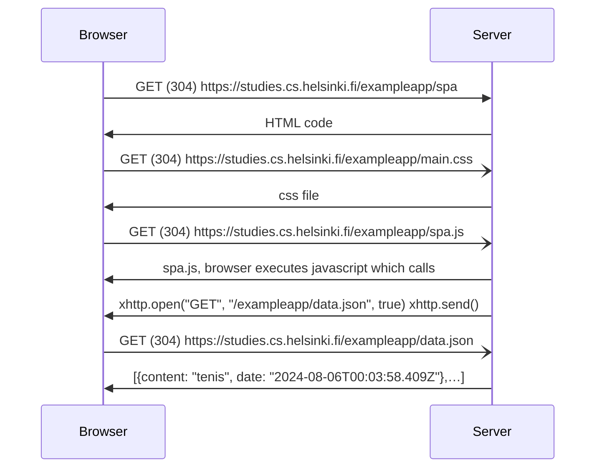

```mermaid
sequenceDiagram
    Browser->>Server: GET (304) https://studies.cs.helsinki.fi/exampleapp/spa
    Server->>Browser: HTML code
    Browser-)Server: GET (304) https://studies.cs.helsinki.fi/exampleapp/main.css
    Server->>Browser: css file
    Browser-)Server: GET (304) https://studies.cs.helsinki.fi/exampleapp/spa.js
    Server->>Browser: spa.js, browser executes javascript which calls
    Server->>Browser: xhttp.open("GET", "/exampleapp/data.json", true) xhttp.send()
    Browser-)Server:  GET (304) https://studies.cs.helsinki.fi/exampleapp/data.json
    Server->>Browser: [{content: "tenis", date: "2024-08-06T00:03:58.409Z"},…]
```
HTTP 304 code = unmodified data, without redirect