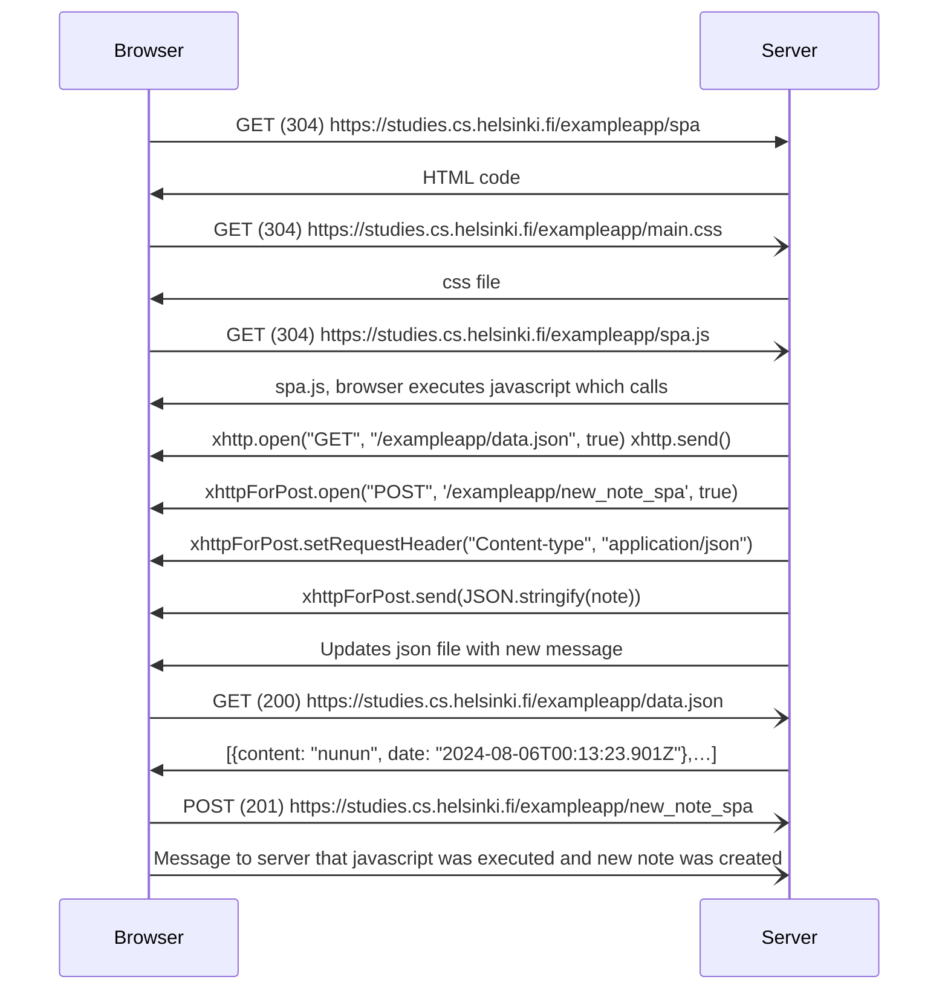

```mermaid
sequenceDiagram
    Browser->>Server: GET (304) https://studies.cs.helsinki.fi/exampleapp/spa
    Server->>Browser: HTML code
    Browser-)Server: GET (304) https://studies.cs.helsinki.fi/exampleapp/main.css
    Server->>Browser: css file
    Browser-)Server: GET (304) https://studies.cs.helsinki.fi/exampleapp/spa.js
    Server->>Browser: spa.js, browser executes javascript which calls
    Server->>Browser: xhttp.open("GET", "/exampleapp/data.json", true) xhttp.send()
    Server->>Browser: xhttpForPost.open("POST", '/exampleapp/new_note_spa', true)
    Server->>Browser: xhttpForPost.setRequestHeader("Content-type", "application/json")
    Server->>Browser: xhttpForPost.send(JSON.stringify(note));
    Server->>Browser: Updates json file with new message
    Browser-)Server:  GET (200) https://studies.cs.helsinki.fi/exampleapp/data.json
    Server->>Browser: [{content: "nunun", date: "2024-08-06T00:13:23.901Z"},…]
    Browser-)Server: POST (201) https://studies.cs.helsinki.fi/exampleapp/new_note_spa
    Browser-)Server: Message to server that javascript was executed and new note was created
```